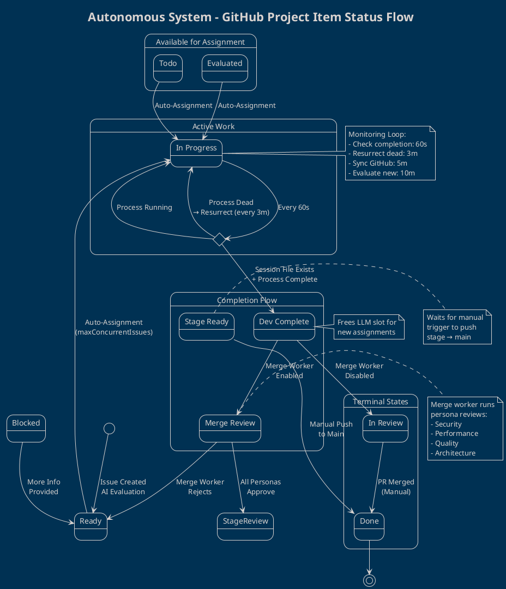
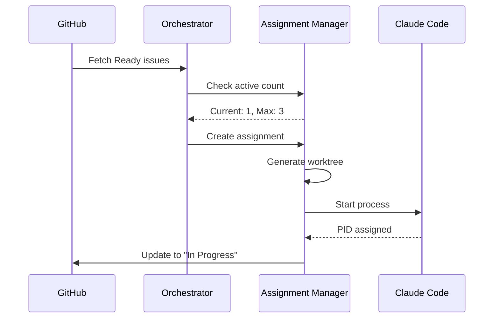
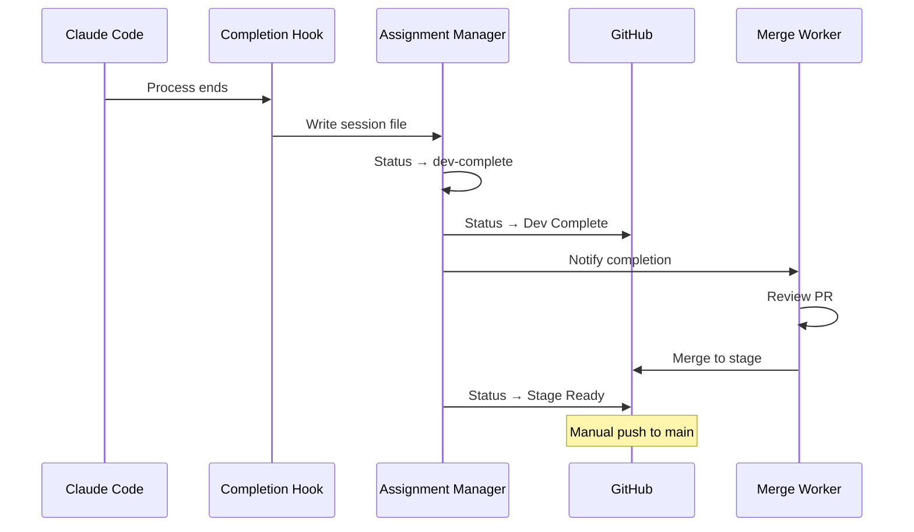
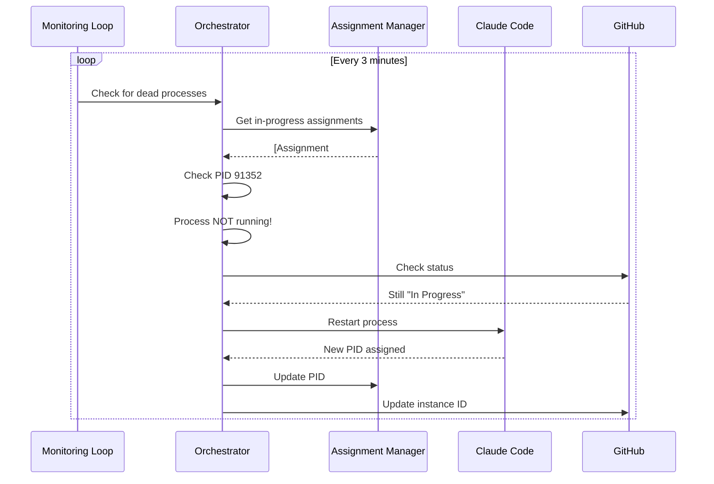

# Status Pipeline & State Management

## Overview

The autonomous system manages GitHub issues through a sophisticated status pipeline that coordinates between:
1. **Local Assignment Database** (`autonomous-assignments.json`) - Process state and work history
2. **GitHub Project Board** - User-visible status and project fields
3. **LLM Instances** - Claude Code processes working on issues

## System Architecture

```
┌─────────────────┐         ┌──────────────────┐         ┌─────────────────┐
│  GitHub Issues  │◄───────►│   Orchestrator   │◄───────►│  LLM Instances  │
│   & Projects    │         │                  │         │  (Claude Code)  │
└─────────────────┘         └──────────────────┘         └─────────────────┘
        │                            │                            │
        │                            │                            │
        ▼                            ▼                            ▼
┌─────────────────┐         ┌──────────────────┐         ┌─────────────────┐
│ GitHub GraphQL  │         │ Assignment Mgr   │         │   Worktrees     │
│      API        │         │ (assignments.json)│         │  (git branches) │
└─────────────────┘         └──────────────────┘         └─────────────────┘
```

### Components

1. **Orchestrator** (`src/core/orchestrator.ts`)
   - Coordinates all system operations
   - Monitors LLM processes
   - Manages assignment lifecycle
   - Periodic resurrection of dead processes

2. **Assignment Manager** (`src/core/assignment-manager.ts`)
   - Local database for process state
   - Conflict detection and resolution
   - Status synchronization with GitHub

3. **GitHub Projects API** (`src/github/projects-api.ts`)
   - GraphQL queries for project data
   - Status and field updates
   - Conflict-free status mapping

4. **Merge Worker** (`src/core/merge-worker.ts`)
   - Automated PR review and merging
   - Stage branch management
   - Final merge to main coordination

## Status Pipeline

### GitHub Project Statuses

The system recognizes these statuses in GitHub Projects:

| Status | Purpose | Auto-Assignable | Terminal |
|--------|---------|-----------------|----------|
| **Ready** | Evaluated and ready for work | ✅ Yes | No |
| **Todo** | Manually marked as ready | ✅ Yes | No |
| **Evaluated** | AI-evaluated, awaiting manual triage | ✅ Yes | No |
| **In Progress** | LLM actively working | No | No |
| **Dev Complete** | Development finished, awaiting merge | No | No |
| **Merge Review** | Merge worker reviewing | No | No |
| **Stage Ready** | Merged to stage branch | No | No |
| **In Review** | Manual PR review | No | No |
| **Done** | Completely finished | No | ✅ Yes |
| **Needs more info** | Blocked, needs clarification | No | No |

### Local Assignment Statuses

Internal statuses tracked in `autonomous-assignments.json`:

| Status | Meaning | Next Status |
|--------|---------|-------------|
| `assigned` | Worktree created, LLM starting | `in-progress` |
| `in-progress` | LLM process actively working | `dev-complete` |
| `dev-complete` | LLM finished, PR created | `merge-review` or `merged` |
| `merge-review` | Merge worker analyzing | `stage-ready` |
| `stage-ready` | Merged to stage branch | `merged` |
| `merged` | Merged to main branch | (terminal) |

### Status Mapping

| GitHub Project | Local Assignment | Direction |
|----------------|------------------|-----------|
| Ready/Todo/Evaluated | (not created) | GitHub → Local |
| In Progress | `assigned` → `in-progress` | Local → GitHub |
| Dev Complete | `dev-complete` | Local → GitHub |
| Merge Review | `merge-review` | Local → GitHub |
| Stage Ready | `stage-ready` | Local → GitHub |
| In Review | `dev-complete` (no merge worker) | Local → GitHub |
| Done | `merged` | Local → GitHub |

## State Diagram

See `docs/STATUS_STATE_DIAGRAM.puml` for the complete PlantUML state diagram.



## Workflow Details

### 1. Assignment Flow



### 2. Completion Flow



### 3. Resurrection Flow



## Capacity Management

The system enforces `maxConcurrentIssues` (default: 3) to prevent overload:

### Counting Rules

**Active assignments** count against capacity:
- Status: `assigned` OR `in-progress`
- Process must be running
- GitHub status: "In Progress"

**Completed assignments** DO NOT count:
- Status: `dev-complete`, `merge-review`, `stage-ready`, `merged`
- These free up LLM slots immediately

### Assignment Logic

```typescript
activeCount = assignments.filter(a =>
  a.llmProvider === 'claude' &&
  (a.status === 'assigned' || a.status === 'in-progress') &&
  isProcessRunning(a.processId)
).length;

available = maxConcurrentIssues - activeCount;

// Assign up to 'available' issues
issuesToAssign = readyIssues.splice(0, available);
```

## Monitoring & Healing

### Periodic Operations

| Operation | Interval | Purpose |
|-----------|----------|---------|
| Check Assignments | 60s | Detect completion via session files |
| Resurrect Dead Processes | 3m | Restart crashed LLM instances |
| Sync from GitHub | 5m | Detect manual status changes |
| Evaluate New Issues | 10m | AI evaluation and auto-assignment |

### Dead Process Detection

A process is considered "dead" if:
1. Status is `in-progress` in local database
2. Process ID (PID) is not running on the system
3. GitHub Project status is NOT in terminal/review states

Resurrection process:
1. Generate continuation prompt
2. Start new LLM instance in existing worktree
3. Update local database with new PID
4. Update GitHub Project "Assigned Instance" field
5. Add work session for resurrection

### Conflict Resolution

When local and GitHub statuses differ:
- **GitHub wins** for status values
- **Local wins** for process state (PIDs, worktrees, sessions)
- Conflicts logged and automatically resolved

## Troubleshooting

### Issue: Only 1 item assigned despite maxConcurrentIssues: 3

**Causes:**
1. Dead process stuck in "In Progress" (counts against capacity)
2. No other issues in "Ready", "Todo", or "Evaluated" status in GitHub Project
3. Other issues have "Assigned Instance" field set (already assigned to dead process)
4. Assignment filter is working correctly but no eligible items exist

**Diagnosis:**
```bash
# Check current assignments and capacity
cd ~/work/v3 && auto status

# Check which items are in Ready statuses
gh project item-list 4 --owner stokedconsulting --format json | jq '.items[] | select(.status == "Ready" or .status == "Todo" or .status == "Evaluated")'

# Check for dead processes
jq '.assignments | map(select(.status == "in-progress")) | .[] | {issue: .issueNumber, pid: .processId}' autonomous-assignments.json
# Then: ps -p <pid> to verify if running
```

**Solutions:**
1. **Wait for resurrection cycle** (every 3m) - will auto-fix dead processes
2. **Manually move issues to Ready/Todo status** in GitHub Project
3. **Clear "Assigned Instance" field** for items stuck with dead assignments
4. **Check status filter**: Verify `.autonomous-config.json` has correct `readyValues`
5. **Force resurrection**: Restart the autonomous system to trigger immediate resurrection

### Issue: Process stuck in "In Progress" forever

**Causes:**
1. Process crashed without creating session file
2. Resurrection logic skipped (GitHub status changed to "In Review"/"Done")
3. Process ID check failing

**Solutions:**
1. Resurrection will auto-fix in next cycle (3m)
2. Manually check GitHub Project status (should be "In Progress")
3. Force resurrection: `auto assign --force <issue-number>`

### Issue: maxConcurrentIssues not being respected

**Causes:**
1. Dead processes not being detected/counted
2. Assignment logic bug
3. GitHub sync lag

**Solutions:**
1. Check `autonomous-assignments.json` for active assignments
2. Verify process IDs are actually running: `ps aux | grep claude`
3. Force sync: `auto status --sync`

## Configuration

### .autonomous-config.json

```json
{
  "llms": {
    "claude": {
      "enabled": true,
      "maxConcurrentIssues": 3,  // Max parallel assignments
      "cliPath": "/path/to/claude",
      "hooksEnabled": true  // Required for completion detection
    }
  },
  "project": {
    "enabled": true,
    "fields": {
      "status": {
        "readyValues": ["Ready", "Todo", "Evaluated"],
        "inProgressValue": "In Progress",
        "reviewValue": "In review",
        "doneValue": "Done"
      }
    }
  }
}
```

### Key Settings

- **maxConcurrentIssues**: Controls parallel work capacity
- **hooksEnabled**: MUST be true for proper completion detection
- **readyValues**: Statuses eligible for auto-assignment
- **inProgressValue**: Status set when work begins

## Best Practices

1. **Monitor Capacity**: Use `auto status` to check active assignments
2. **Enable Hooks**: Required for clean completion detection
3. **Use Project Statuses**: Leverage "Ready" status for prioritization
4. **Stage Branch Workflow**: Enable merge worker for automated review
5. **Manual Main Merge**: Keep final production merge as manual approval step

## Architecture Decisions

### Why GitHub wins status conflicts?

Users can manually change status in GitHub Project (e.g., pause work, skip to review). The system respects these manual interventions.

### Why resurrection every 3 minutes?

- Fast enough to catch crashes quickly
- Slow enough to avoid overhead
- Aligns with monitoring cycle timing

### Why dev-complete frees LLM slots immediately?

- LLM process has ended (resources released)
- Merge worker is separate, doesn't consume LLM capacity
- Allows higher throughput

### Why separate stage and main branches?

- Stage branch: automated testing ground
- Main branch: requires manual approval
- Prevents automated bugs from reaching production
- Gives human oversight on final deployment

## Related Documentation

- [Merge Worker Design](../MERGE_WORKER_DESIGN.md)
- [GitHub Projects Integration](../docs/GITHUB_PROJECTS.md)
- [Configuration Guide](../README.md#configuration)
